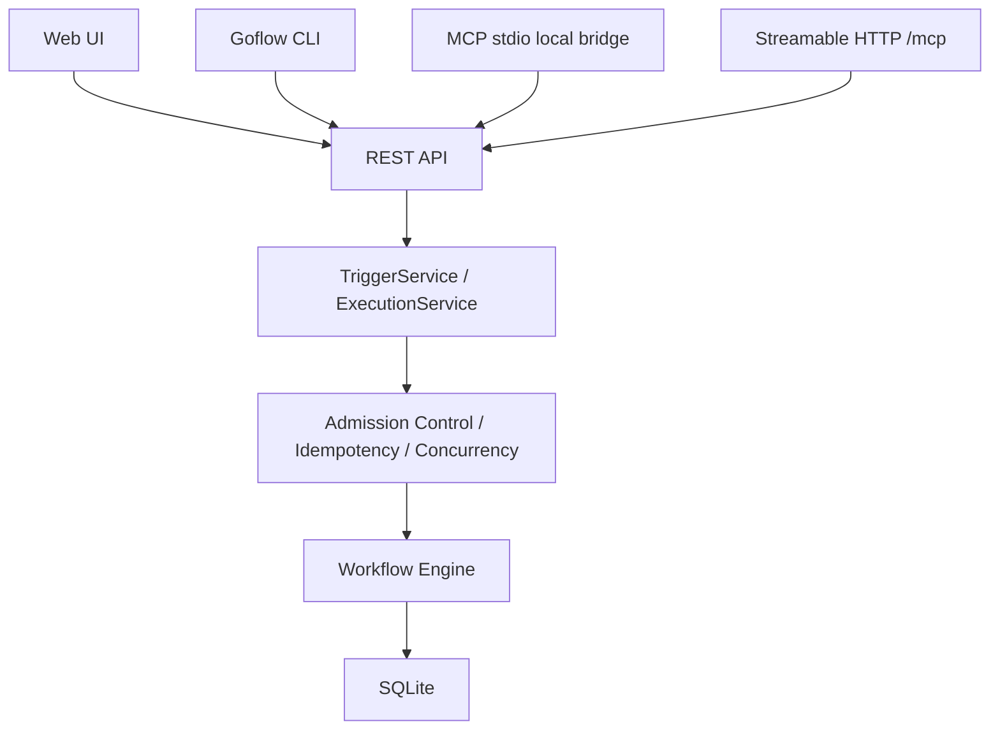

# Goflow CLI and MCP Roadmap

This document describes a proposed expansion of Goflow into a CLI-controllable and MCP-compatible automation runtime.

The direction is feasible, but it should be delivered in small preview releases. CLI and MCP should not create a second runtime path; they should call the same REST/application services used by the Web UI, webhooks, and cron.

Current implementation progress is tracked in `ROADMAP_PROGRESS.md`.

## Product Goal

After this expansion, Goflow should support four usage interfaces:

| Interface | Primary users | Purpose |
| :--- | :--- | :--- |
| Web UI | Direct users | Design, configure, and monitor workflows |
| REST / Webhook | External applications | System integration |
| CLI | Developers, DevOps, sysadmins | Scripting, CI/CD, workflow-as-code |
| MCP | AI clients and agents | Discover and run workflows as AI tools |

Target positioning:

> Goflow is a local-first automation runtime that can be controlled by humans, scripts, applications, and AI agents.

This expansion must preserve the current Goflow principles:

- One executable.
- No required Docker runtime.
- No required PostgreSQL or Redis.
- SQLite remains the default storage.
- CLI and MCP must not create a separate runtime.
- Community Edition remains useful for individual and internal self-hosted automation.

## Current Technical Gaps

### REST Trigger Exists

Existing endpoints:

```http
POST /api/v1/workflows/{id}/trigger
POST /api/v1/workflows/{id}/trigger?async=true
POST /webhook/{workflowId}
```

CLI and MCP do not need to open the database or initialize the engine directly. They can call REST once the execution API is standardized.

### Async Trigger Does Not Return Execution ID

Current async behavior only returns a message:

```json
{
  "message": "Workflow triggered in background"
}
```

This is not enough for CLI or MCP. Clients need to:

- Know which execution was created.
- Watch status.
- Avoid duplicate retries after timeouts.
- Cancel execution.
- Query results later.

### Workflow Metadata Is Missing

The current workflow model does not yet contain enough metadata for CLI/MCP contracts:

- Slug for CLI references.
- Input schema.
- Output schema.
- CLI exposure flag.
- MCP exposure flag.
- Risk level.
- Idempotency behavior.
- Concurrency policy.
- Tool description for AI clients.

### Cancellation Is Not Standardized

Node executors currently receive Goflow's execution context, not a standard `context.Context`. Long-running nodes need context propagation before cancellation can be reliable.

### Schema Migration Framework Is Needed

Goflow currently creates tables with `CREATE TABLE IF NOT EXISTS`. That is not enough once schema changes include workflow interfaces, idempotency, tokens, queueing, and audit metadata.

## Target Architecture



Important rules:

- CLI must not open SQLite directly.
- MCP stdio must not initialize its own engine.
- All execution must pass through one server-side engine and one concurrency model.
- CLI and MCP should share an internal REST client package.

## Proposed Source Structure

```text
goflow/
├── cmd/
│   ├── root.go
│   ├── serve.go
│   ├── status.go
│   ├── config.go
│   ├── workflow.go
│   ├── execution.go
│   └── mcp.go
├── internal/
│   ├── application/
│   │   ├── trigger_service.go
│   │   ├── execution_service.go
│   │   ├── workflow_service.go
│   │   └── errors.go
│   ├── client/
│   │   ├── api_client.go
│   │   ├── workflow_client.go
│   │   └── execution_client.go
│   ├── mcpserver/
│   │   ├── server.go
│   │   ├── tools.go
│   │   ├── dynamic_tools.go
│   │   ├── auth.go
│   │   └── mapper.go
│   ├── api/
│   ├── engine/
│   ├── nodes/
│   └── storage/
│       ├── migrations/
│       └── migration_runner.go
└── ui/
```

Layer responsibilities:

- `cmd`: parse commands, render output, manage profiles. No business logic and no SQLite access.
- `internal/client`: shared Go REST client for CLI, MCP stdio, integration tests, and future Go consumers.
- `internal/application`: common service layer for Web UI/API, webhook, cron, CLI, and MCP.
- `internal/mcpserver`: MCP server setup, tool mapping, schema validation, and calls into the REST client or service layer.

## Foundation Work

### TriggerService

Proposed model:

```go
type TriggerSource string

const (
	SourceUI      TriggerSource = "ui"
	SourceAPI     TriggerSource = "api"
	SourceWebhook TriggerSource = "webhook"
	SourceCron    TriggerSource = "cron"
	SourceCLI     TriggerSource = "cli"
	SourceMCP     TriggerSource = "mcp"
)

type TriggerRequest struct {
	WorkflowID      string
	Input           any
	Mode            string
	IdempotencyKey  string
	Source          TriggerSource
	Principal       string
	RequestID       string
}

type TriggerResult struct {
	ExecutionID  string `json:"execution_id"`
	Status       string `json:"status"`
	Deduplicated bool   `json:"deduplicated"`
}

type TriggerService interface {
	Trigger(ctx context.Context, req TriggerRequest) (*TriggerResult, error)
}
```

`Source`, `Principal`, and `RequestID` must be assigned by trusted adapters or middleware, not blindly trusted from caller input.

### Async Execution ID

Replace async trigger behavior with an execution record created before the goroutine starts.

Flow:

1. Validate workflow.
2. Check access, idempotency, and concurrency.
3. Create execution record.
4. Return `execution_id`.
5. Run workflow in the background.
6. Update final status and output.

Recommended response:

```json
{
  "execution_id": "exec_123",
  "workflow_id": "wf_123",
  "status": "RUNNING",
  "deduplicated": false
}
```

HTTP status should be `202 Accepted`.

### Execution Statuses

Recommended statuses:

- `QUEUED`
- `RUNNING`
- `SUCCESS`
- `FAILED`
- `CANCELLED`
- `INTERRUPTED`
- `REJECTED`

`QUEUED` can exist in the model before a persistent queue is implemented.

### Cancellation

Add context propagation to execution:

```go
type ExecutionContext struct {
	Context     context.Context
	Cancel      context.CancelFunc
	WorkflowID  string
	ExecutionID string
}
```

Nodes that should use cancellation early:

- HTTP Request
- Delay / Sleep
- AI nodes
- Database nodes
- SSH runner

Library calls that do not support context should be treated as best-effort cancellation.

## API Design

Keep old endpoints for compatibility, but add clearer execution endpoints.

### Trigger Workflow

```http
POST /api/v1/workflows/{id}/executions
```

Request:

```json
{
  "input": {
    "date": "2026-07-25"
  },
  "mode": "async",
  "idempotency_key": "daily-report-2026-07-25"
}
```

Response:

```json
{
  "execution_id": "exec_123",
  "workflow_id": "wf_123",
  "status": "RUNNING",
  "deduplicated": false
}
```

### Execution Endpoints

```http
GET  /api/v1/executions/{id}
GET  /api/v1/executions/{id}/logs
POST /api/v1/executions/{id}/cancel
GET  /api/v1/executions?workflow_id=...&status=...
```

### Workflow Interface Metadata

```http
GET /api/v1/workflows/{id}/interface
PUT /api/v1/workflows/{id}/interface
```

Example:

```json
{
  "slug": "prepare-daily-report",
  "input_schema": {
    "type": "object",
    "properties": {
      "date": {
        "type": "string",
        "format": "date"
      }
    },
    "required": ["date"],
    "additionalProperties": false
  },
  "output_schema": {
    "type": "object"
  },
  "cli": {
    "enabled": true
  },
  "mcp": {
    "enabled": true,
    "tool_name": "prepare_daily_report",
    "description": "Prepare and send the daily operations report"
  },
  "risk": {
    "level": "medium",
    "requires_approval": false,
    "read_only": false,
    "destructive": false,
    "idempotent": true,
    "open_world": true
  }
}
```

## CLI Plan

### One Binary

Keep one executable:

```bash
goflow
```

Default command can remain equivalent to:

```bash
goflow serve
```

### Command Tree

```text
goflow
├── serve
├── status
├── config
│   ├── init
│   ├── show
│   ├── set
│   └── use-profile
├── workflow
│   ├── list
│   ├── get
│   ├── describe
│   ├── run
│   ├── validate
│   ├── import
│   ├── export
│   ├── enable
│   └── disable
├── execution
│   ├── list
│   ├── get
│   ├── logs
│   ├── watch
│   └── cancel
└── mcp
    ├── stdio
    └── serve
```

### MVP Commands

```bash
goflow status
goflow workflow list
goflow workflow list --active
goflow workflow list --output json
goflow workflow describe prepare-daily-report
goflow workflow run prepare-daily-report --input payload.json --async
goflow workflow run prepare-daily-report --json '{"date":"2026-07-25"}' --wait --timeout 60s
goflow execution get exec_123
goflow execution watch exec_123
```

`execution watch` can poll REST every 500-1000 ms in the first version. A streaming transport is not required for CLI MVP.

### Input Methods

Support:

- `--input payload.json`
- `--json '{"key":"value"}'`
- `--set date=2026-07-25`
- `--stdin`

Priority:

1. `--json`
2. `--input`
3. `--stdin`
4. `--set`
5. Empty object

Do not allow multiple input sources in one command, except repeated `--set`.

### Output Formats

Support:

- `--output table`
- `--output json`
- `--output yaml`
- `--quiet`

Defaults:

- TTY: table or human-readable output.
- Scripts/CI: recommend `--output json`.
- `--quiet`: print only execution ID or the final value.

### Exit Codes

| Code | Meaning |
| :---: | :--- |
| 0 | Success |
| 1 | Execution failed |
| 2 | Invalid command or input |
| 3 | Authentication failed |
| 4 | Cannot connect to server |
| 5 | Workflow not found |
| 6 | Concurrency or rate limit |
| 7 | Timeout |
| 8 | Execution cancelled |

### CLI Configuration

Priority:

1. Flag
2. Environment variable
3. Profile file
4. Default

Environment:

```bash
GOFLOW_URL=http://127.0.0.1:8080
GOFLOW_API_KEY=...
GOFLOW_PROFILE=local
```

Profile example:

```yaml
current_profile: local
profiles:
  local:
    url: http://127.0.0.1:8080
  server:
    url: https://goflow.example.com
```

API keys should not be stored as plaintext by default. Community MVP can read keys from environment variables or from a user-selected restricted-permission file. OS keychain support can come later.

## MCP Plan

### SDK

Use the official Go SDK:

```text
github.com/modelcontextprotocol/go-sdk/mcp
```

Pin a specific version in `go.mod`. Do not implement JSON-RPC manually.

### Transport Order

Start with stdio:

```bash
goflow mcp stdio
```

For stdio:

- `stdout` must contain only MCP JSON-RPC messages.
- logs must go to `stderr`.
- credentials should come from environment/profile configuration.

Add Streamable HTTP later:

```http
POST /mcp
GET  /mcp
```

For remote HTTP MCP:

- Validate `Origin`.
- Bind localhost by default.
- Require authentication for remote access.
- Apply request size limits and rate limits.
- Add client identity and audit metadata.

Do not build the older HTTP+SSE transport as the primary path.

### Tool Layers

Static administration tools:

- `goflow_list_workflows`
- `goflow_get_workflow`
- `goflow_run_workflow`
- `goflow_get_execution`
- `goflow_list_executions`
- `goflow_cancel_execution`

Dynamic workflow tools:

- `goflow.prepare_daily_report`
- `goflow.process_supplier_invoice`
- `goflow.backup_application`

Dynamic tools use:

- Workflow description.
- Input schema.
- Output schema.
- Risk annotations.
- Idempotency metadata.

### Workflow To MCP Tool Mapping

Conceptual mapping:

```go
func WorkflowToMCPTool(wf Workflow) *mcp.Tool {
	return &mcp.Tool{
		Name:        "goflow." + wf.MCPToolName,
		Description: wf.MCPDescription,
		InputSchema: parseSchema(wf.InputSchemaJSON),
		OutputSchema: parseSchema(wf.OutputSchemaJSON),
		Annotations: &mcp.ToolAnnotations{
			ReadOnlyHint:    wf.ReadOnly,
			DestructiveHint: wf.Destructive,
			IdempotentHint:  wf.Idempotent,
			OpenWorldHint:   wf.OpenWorld,
		},
	}
}
```

Annotations are hints for clients. They must not replace server-side validation or permissions.

### MCP Execution Model

MCP workflow calls should default to async:

```text
tools/call
→ Goflow creates execution
→ returns execution_id
```

Response:

```json
{
  "execution_id": "exec_123",
  "workflow": "prepare-daily-report",
  "status": "RUNNING",
  "status_tool": "goflow_get_execution"
}
```

MVP should use `goflow_run_workflow` and `goflow_get_execution`. MCP task support can be considered after Goflow's execution API is stable.

### Tool Errors

Separate protocol errors from tool execution errors.

Protocol errors:

- Tool does not exist.
- JSON-RPC is invalid.
- Arguments do not match protocol shape.

Tool execution errors:

- Workflow not found.
- Input does not match schema.
- Concurrency limit.
- Workflow failed.
- Permission denied.
- Approval required.

Business and input errors should generally be returned as tool results with `isError: true` so the model can read and adjust.

## Database Migrations

Create:

```text
internal/storage/migrations/
├── 0001_initial.sql
├── 0002_workflow_interfaces.sql
├── 0003_execution_invocation.sql
├── 0004_idempotency.sql
└── 0005_access_tokens.sql
```

Migration state:

```sql
CREATE TABLE schema_migrations (
  version INTEGER PRIMARY KEY,
  applied_at DATETIME NOT NULL
);
```

Migration requirements:

- Run transactionally during startup.
- Backup database before migration.
- Record applied version.
- Do not rerun applied migrations.
- Stop startup if migration fails.

### Workflow Metadata Columns

```sql
ALTER TABLE workflows ADD COLUMN slug TEXT;
ALTER TABLE workflows ADD COLUMN input_schema_json TEXT NOT NULL DEFAULT '{}';
ALTER TABLE workflows ADD COLUMN output_schema_json TEXT NOT NULL DEFAULT '{}';
ALTER TABLE workflows ADD COLUMN expose_cli INTEGER NOT NULL DEFAULT 1;
ALTER TABLE workflows ADD COLUMN expose_mcp INTEGER NOT NULL DEFAULT 0;
ALTER TABLE workflows ADD COLUMN mcp_tool_name TEXT;
ALTER TABLE workflows ADD COLUMN mcp_description TEXT;
ALTER TABLE workflows ADD COLUMN risk_level TEXT NOT NULL DEFAULT 'medium';
ALTER TABLE workflows ADD COLUMN requires_approval INTEGER NOT NULL DEFAULT 0;
ALTER TABLE workflows ADD COLUMN max_concurrent_runs INTEGER NOT NULL DEFAULT 0;
ALTER TABLE workflows ADD COLUMN concurrency_policy TEXT NOT NULL DEFAULT 'global';

CREATE UNIQUE INDEX idx_workflows_slug
ON workflows(slug)
WHERE slug IS NOT NULL;

CREATE INDEX idx_workflows_mcp
ON workflows(expose_mcp, is_active);
```

### Execution Invocation Metadata

```sql
ALTER TABLE executions ADD COLUMN trigger_source TEXT;
ALTER TABLE executions ADD COLUMN trigger_principal TEXT;
ALTER TABLE executions ADD COLUMN request_id TEXT;
ALTER TABLE executions ADD COLUMN idempotency_key TEXT;
ALTER TABLE executions ADD COLUMN input_json TEXT;
ALTER TABLE executions ADD COLUMN error_message TEXT;
ALTER TABLE executions ADD COLUMN cancelled_at DATETIME;

CREATE INDEX idx_executions_source
ON executions(trigger_source, started_at DESC);

CREATE UNIQUE INDEX idx_execution_idempotency
ON executions(workflow_id, idempotency_key)
WHERE idempotency_key IS NOT NULL;
```

## Concurrency And Admission Control

### Global Workflow Limit

Keep:

```bash
GOFLOW_MAX_CONCURRENT_EXECUTIONS=10
```

All trigger sources must share this quota.

### Node Concurrency

Add later:

```bash
GOFLOW_MAX_PARALLEL_NODES_PER_EXECUTION=4
```

Each execution should have its own node semaphore.

### MCP Client Limit

Add:

```bash
GOFLOW_MCP_MAX_INFLIGHT_PER_CLIENT=2
GOFLOW_MCP_RATE_LIMIT_PER_MINUTE=30
```

One MCP agent should not be able to consume all global execution slots.

### Per-Workflow Concurrency

Metadata:

```json
{
  "max_concurrent_runs": 1,
  "concurrency_policy": "queue"
}
```

Policies:

- `global`
- `allow`
- `reject`
- `queue`

MVP should support `global` and `reject`. `queue` can come later.

### Persistent Bounded Queue

Add after CLI/MCP beta:

```bash
GOFLOW_MAX_QUEUED_EXECUTIONS=100
```

Do not use an unbounded queue. Community Edition can store queued executions directly in SQLite with `QUEUED` status; Redis should not be required.

### Sub-Workflow Slot Usage

Current sub-workflow execution can consume additional global slots. Longer term, move to an execution tree model:

```text
Root execution holds global slot
→ child workflow uses same root permit
→ child still respects node limit and depth limit
```

Add:

```bash
GOFLOW_MAX_SUBWORKFLOW_DEPTH=5
```

## Idempotency

Idempotency is required for MCP because agents and clients may retry after timeouts.

Request:

```json
{
  "idempotency_key": "agent-session-123-task-456"
}
```

Uniqueness:

```text
workflow_id + idempotency_key
```

If an execution already exists:

```json
{
  "execution_id": "exec_existing",
  "status": "RUNNING",
  "deduplicated": true
}
```

CLI:

```bash
goflow workflow run send-report --idempotency-key report-2026-07-25
```

If the user does not provide a key:

- CLI should not auto-generate stable keys for unrelated calls.
- MCP bridge should pass a stable request ID when a client provides one.
- Side-effect workflows should recommend idempotency keys.

## Security Model

### MCP stdio

- Local only.
- API key read from environment/profile.
- No OAuth.
- Do not print secrets to stdout.
- Process only connects to the configured Goflow URL.

### MCP Streamable HTTP

Remote MVP:

```http
Authorization: Bearer <scoped-token>
```

Required:

- Validate `Origin`.
- Bind localhost by default.
- Require TLS when public.
- Limit request size.
- Rate limit.
- Track client identity.
- Add audit metadata.

OAuth can be deferred to later Pro/Enterprise work.

### Scoped Tokens

Scopes:

- `workflow:list`
- `workflow:read`
- `workflow:run`
- `execution:read`
- `execution:cancel`

Token metadata can include workflow allowlists:

```json
{
  "scopes": [
    "workflow:list",
    "workflow:run",
    "execution:read"
  ],
  "allowed_workflows": [
    "prepare-daily-report",
    "process-document"
  ]
}
```

Store only token hashes:

```text
SHA-256(token + server_pepper)
```

Raw tokens should be shown only once at creation.

### Workflow Exposure

Default:

```json
{
  "expose_mcp": false
}
```

Only active workflows explicitly exposed to MCP should appear in `tools/list`.

Do not automatically expose:

- SSH workflows.
- Database mutation workflows.
- Email campaign workflows.
- Delete operations.
- Untrusted plugin workflows.

### High-Risk Workflows

MVP:

```json
{
  "requires_approval": true
}
```

High-risk workflows should not be exposed as dynamic MCP tools in MVP.

Future approval flow:

```text
MCP request
→ APPROVAL_REQUIRED
→ user approves in UI/CLI
→ workflow runs
```

Do not rely on a simple `confirm: true` input field because an agent could fill it automatically.

## UI Additions

Add an `Interfaces` tab in the Workflow Editor.

CLI section:

- Enable CLI.
- Slug.
- Input schema.
- Example command.
- Copy command.

Example:

```bash
goflow workflow run prepare-daily-report --json '{"date":"2026-07-25"}'
```

MCP section:

- Enable MCP.
- Tool name.
- Tool title.
- Tool description.
- Input schema.
- Output schema.
- Read-only.
- Destructive.
- Idempotent.
- Open-world.
- Risk level.
- Requires approval.

Execution view additions:

- Trigger source.
- Trigger principal.
- Request ID.
- Idempotency key.
- MCP client identity.
- Cancellation status.

## Testing Strategy

### Unit Tests

Trigger service:

- Workflow not found.
- Workflow inactive.
- Invalid input schema.
- Idempotency deduplication.
- Global limit.
- Per-workflow limit.
- Source/principal recorded correctly.

CLI parser:

- Input from file.
- Invalid JSON input.
- Exit code mapping.
- JSON output.
- Timeout.
- Server unavailable.

MCP mapping:

- Workflow slug to tool name.
- Invalid tool name.
- Input schema.
- Output schema.
- Annotations.
- Disabled workflow does not appear.

### Integration Tests

CLI:

```text
Start temporary Goflow server
→ create workflow
→ call CLI
→ receive execution ID
→ wait for SUCCESS
→ verify database
```

MCP:

```text
Start Goflow
→ start MCP stdio subprocess
→ initialize session
→ tools/list
→ tools/call
→ verify execution
```

### Concurrency Tests

- 20 CLI calls concurrently.
- 20 MCP calls concurrently.
- MCP client cannot exceed inflight limit.
- Cron can still run under MCP load.
- Sub-workflow does not deadlock.
- Node goroutines do not exceed configured limit.
- SQLite does not return `database locked`.

### Security Tests

- MCP tool does not see unexposed workflows.
- Token without scope is denied.
- Invalid `Origin` returns 403.
- Secrets do not appear in logs.
- Oversized MCP request is blocked.
- Tool input outside schema is rejected.
- MCP stdio stdout contains no regular logs.

### Recovery Tests

- Kill Goflow during execution.
- Restart server.
- Old `RUNNING` executions become `INTERRUPTED`.
- MCP retry with the same idempotency key does not duplicate side effects.
- CLI watch handles server reconnect.

## Delivery Plan

The original plan is a 12-week ideal roadmap. For a solo developer, a safer expectation is 16-24 weeks with testing and migration hardening.

### Phase 1: Foundation Preview

Target release: `v0.2.0-foundation-preview`

- Migration framework.
- Application service layer.
- TriggerService.
- ExecutionService.
- Async execution ID.
- Execution query API.
- Trigger source/principal.
- Idempotency.

Definition of done:

- Existing databases migrate without losing workflows, executions, or credentials.
- All trigger sources use one service path.
- Async trigger can be tracked immediately.
- Idempotency prevents duplicate side-effect execution.

### Phase 2: CLI Alpha

Target release: `v0.3.0-cli-alpha`

- `goflow serve`.
- `goflow status`.
- `goflow workflow list`.
- `goflow workflow describe`.
- `goflow workflow run`.
- `goflow execution get`.
- `goflow execution watch`.
- JSON output.
- Exit codes.
- Basic config profiles.

Definition of done:

- CLI works in shell scripts and GitHub Actions.
- CLI does not access SQLite directly.
- CLI can run and watch workflows using REST.

### Phase 3: MCP stdio Alpha

Target release: `v0.4.0-mcp-stdio-alpha`

- Add official MCP Go SDK.
- `goflow mcp stdio`.
- Static MCP tools:
  - `goflow_list_workflows`
  - `goflow_run_workflow`
  - `goflow_get_execution`
  - `goflow_list_executions`
- stdout/stderr separation.

Definition of done:

- An MCP client can list workflows, run a workflow, and check execution status.
- MCP server does not expose secrets.
- MCP stdio uses the configured Goflow server.

### Phase 4: Dynamic MCP Preview

Target release: `v0.5.0-mcp-dynamic-preview`

- Workflow interface metadata.
- Input/output schema.
- CLI/MCP toggles.
- Risk metadata.
- UI Interfaces tab.
- Dynamic workflow-to-tool mapping.
- MCP allowlist.

Definition of done:

- AI clients see exposed workflows as separate tools.
- Unexposed workflows are invisible to MCP.
- Input schema validation happens server-side.

### Phase 5: Hardening

Target release: later preview/beta

- Per-client MCP inflight limit.
- Node concurrency semaphore.
- Sub-workflow root permit.
- Max sub-workflow depth.
- Cancellation API.
- CLI cancel.
- MCP cancel.
- Better execution error model.
- Scoped token.
- Audit metadata.

### Phase 6: Streamable HTTP Beta

Target release: after stdio and dynamic tools are stable

- `/mcp` Streamable HTTP endpoint.
- Origin validation.
- Bearer token auth.
- Scoped permissions.
- Localhost default.
- Audit metadata.
- Documentation and threat model.

## Community And Commercial Split

Community:

- Full local CLI.
- REST client.
- Workflow-as-code.
- MCP stdio.
- Dynamic MCP workflow tools.
- Local Streamable HTTP on localhost.
- One local administrator/API key.
- Basic rate limit.
- Basic execution logs.

Pro:

- Remote MCP endpoint.
- Multiple scoped tokens.
- Per-agent permissions.
- Workflow allowlist.
- Audit logs.
- Approval workflow.
- Long-term execution retention.
- Advanced concurrency policy.

Enterprise:

- SSO/OIDC.
- RBAC.
- Team workspaces.
- Central policy.
- MCP client identity mapping.
- Air-gapped deployment.
- Signed workflow definitions.
- Central approval.
- Compliance export.

## Not In MVP

Do not do these in the MVP:

- Let CLI open SQLite directly.
- Initialize a separate engine in MCP stdio.
- Build OAuth for MCP immediately.
- Expose every workflow by default.
- Let agents read credentials.
- Run long workflows synchronously through MCP.
- Implement MCP protocol by hand.
- Target unstable draft MCP features as the primary path.
- Build a persistent distributed queue.
- Move Community storage to PostgreSQL.
- Rewrite the frontend.
- Add a marketplace.
- Add multi-tenant SaaS behavior.

## Final Priority

P0:

1. Migration framework.
2. TriggerService shared by all trigger paths.
3. Async execution ID.
4. Execution source/principal.
5. Idempotency.
6. CLI `list`, `run`, and `watch`.
7. MCP stdio static tools.
8. Workflow input schema.
9. Workflow MCP allowlist.
10. Global/per-client concurrency.

P1:

1. Dynamic MCP workflow tools.
2. Node concurrency limit.
3. Sub-workflow nested slot fix.
4. Cancellation.
5. CLI import/export/validate.
6. UI Interfaces tab.
7. Scoped token.
8. Audit metadata.

P2:

1. Streamable HTTP public deployment.
2. Approval workflow.
3. Persistent execution queue.
4. Per-workflow queue policy.
5. MCP Tasks.
6. OS keychain.
7. Remote profile management.
8. Pro governance features.

## Success Metrics

Within 30 days after CLI/MCP beta:

- At least 10 workflows are run through CLI.
- At least 3 CI/CD pipelines use Goflow CLI.
- An MCP client can run a workflow without knowing the underlying credentials.
- No execution exceeds global concurrency.
- No duplicate side effect occurs in idempotency tests.
- No secret appears in MCP output.
- Dynamic workflow tools have accurate input schemas.
- MCP agents cannot see unexposed workflows.
- CLI works on Windows and Linux.
- A new user can configure MCP in under 15 minutes.

## Architecture Decision

The first implementation should be:

```text
One goflow binary
+ CLI calling REST API
+ MCP stdio bridge calling REST API
+ shared TriggerService
+ async execution ID
+ workflow input schema
+ dynamic MCP tools
+ idempotency
+ concurrency protection
```

Do not replace Go with another language for this work. CLI, REST client, and MCP server are a good fit for Go, especially because Goflow is already a single-binary Go application.

The goal is not just to add two interfaces. The goal is to turn Goflow into an automation runtime with explicit contracts that can be safely called from terminals, CI/CD systems, and AI agents.
