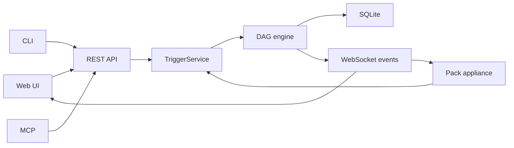

# Goflow

A local-first workflow automation engine that can turn workflows into portable,
task-specific applications.

[](https://github.com/hstptcn5/Goflow/actions/workflows/ci.yml)
[](go.mod)
[](docs/COMMUNITY_RELEASE_POLICY.md)
[](LICENSE)

Goflow combines four parts in one local-first platform:

- a workflow engine and embedded Vue studio;
- Pack Format v1 for declarative, portable workflows;
- a focused appliance runtime with first-run setup and persistent local state;
- a workflow App Builder that emits one executable with a generated input/output UI;
- REST, CLI, and MCP entry points backed by the same execution path.

The default deployment is one Go executable with SQLite. It needs no Docker,
Node.js runtime, external database, or separate frontend server. Workflows,
execution history, setup state, and encrypted credentials remain local unless a
workflow explicitly sends data elsewhere.

Community `1.0.0-rc.1` is an unsigned release candidate, not a stable GitHub
Release. See the [release policy](docs/COMMUNITY_RELEASE_POLICY.md),
[installation guide](docs/INSTALLATION.md), and
[upgrade guide](docs/COMMUNITY_UPGRADE.md).

## Quick Start

### Run the workflow platform

Requirement: Go `1.25.13`.

```bash
git clone https://github.com/hstptcn5/Goflow.git
cd Goflow
go build -o goflow main.go static_embed.go
./goflow serve
```

Windows PowerShell:

```powershell
git clone https://github.com/hstptcn5/Goflow.git
Set-Location Goflow
go build -o goflow.exe main.go static_embed.go
.\goflow.exe serve
```

Open [http://127.0.0.1:8080](http://127.0.0.1:8080), create a workflow, connect
a trigger to one or more actions, save it, and run a test execution.

### Validate and run a Pack

```bash
./goflow pack validate ./examples/packs/hello-webhook
./goflow pack test ./examples/packs/hello-webhook
./goflow pack run ./examples/packs/hello-webhook
```

On Windows, replace `./goflow` with `.\goflow.exe`.

## Two Ways To Use Goflow

### Workflow automation platform

Use the visual studio to build and inspect workflows with triggers, mappings,
built-in nodes, credentials, execution history, and debugging tools. Operate the
same workflows through the browser, REST API, CLI, or MCP.

This mode fits developer tools, local automation, agent-controlled operations,
webhook routing, and scheduled internal jobs.

### Portable Pack appliance

A Pack declares a managed workflow, non-secret setup fields, credential slots,
bindings, assets, and required host capabilities. Pack Run serves a focused
loopback UI for setup, manual or scheduled execution, diagnostics, and restart.

Runtime state is stored outside the Pack and application directory. Managed
workflow identity, configuration, credential references, and schedules persist
across restarts. Host-managed migrations can require setup revalidation before
execution resumes.

### Build a workflow as an app

Open a workflow in the editor, select **Build App**, review the Green/Yellow/Red
portability report, configure the generated form and output node, then select
**Build & tải ứng dụng**. Goflow downloads one executable for the platform on
which the server is running. The destination machine does not need Go or a
separate frontend install. Credentials are not copied into the file; supported
credential-backed nodes request them during first-run setup.

Python Code workflows can be built with a Yellow portability warning and require
Python 3 on the destination machine because Python is not embedded. Native plugins,
sub-workflows, SSH/Git commands, and local file/path dependencies remain blocked. See the
[App Builder roadmap](APP_BUILDER_ROADMAP.md) for the portability contract.

## Capabilities

- Visual workflow studio with mappings, execution inspection, retry, replay,
  cancellation, and bounded diagnostics.
- DAG execution with webhook, cron, manual, and GitHub webhook triggers.
- Built-in HTTP, data, communication, database, infrastructure, and AI nodes.
- REST API, WebSocket updates, CLI, MCP stdio, and MCP Streamable HTTP.
- Scoped tokens, workflow allowlists, idempotency, audit events, and encrypted
  credential storage.
- Declarative Packs with setup schemas, deterministic builds, integrity checks,
  external state, scheduling, migration, and rollback foundations.

## Pack Lifecycle

```text
pack init -> pack validate -> pack test -> pack build -> pack verify -> pack run
```

Representative commands:

```bash
goflow pack init ./my-pack --id example.my-pack --name "My Pack"
goflow pack validate ./my-pack
goflow pack test ./my-pack --output json
goflow pack build ./my-pack --output ./dist
goflow pack verify ./dist/example.my-pack-0.1.0-linux-amd64.zip
goflow pack run ./my-pack --data-dir ./pack-data --no-open
```

Pack Format v1 is declarative. Validation and build do not execute packaged
plugins. `PACK_INFO.json` provides file integrity, not publisher authenticity.
Optional Ed25519 verification requires an explicitly trusted external public
key. Pack Run is loopback-only and does not support packaged plugin execution.

See [Pack Format](docs/PACKS.md), the
[Pack author tutorial](docs/PACK_AUTHOR_TUTORIAL.md), and
[signing boundary](docs/PACK_SIGNING.md).

## Examples

### Hello Webhook

[`hello-webhook`](examples/packs/hello-webhook/) is a minimal Pack for learning
the validate, test, and Pack Run flow.

### DailyOps

[`dailyops-rest-telegram`](examples/packs/dailyops-rest-telegram/) is the reference
beta appliance. It validates a normalized HTTP(S) JSON report, formats one daily
operations summary, and sends one Telegram message. It supports Run now and one
daily schedule with an IANA timezone; it does not claim vendor compatibility.
Use sanitized data and a dedicated non-production bot when evaluating it.

Read the [source contract](docs/BETA_SOURCE_JSON_CONTRACT.md),
[Telegram setup](docs/BETA_TELEGRAM_SETUP.md),
[schedule guide](docs/BETA_SCHEDULE_TIMEZONE.md), and
[Windows pilot guide](docs/WINDOWS_PILOT_GUIDE.md).

## Architecture And Entry Points

The Web UI, REST clients, CLI, MCP, webhooks, schedules, and Pack appliance host
converge on the shared TriggerService and DAG engine.


```mermaid
flowchart LR
    UI["Web UI"] --> API["REST API"]
    CLI["CLI"] --> API
    MCP["MCP"] --> API
    PACK["Pack appliance"] --> TS["TriggerService"]
    API --> TS
    TS --> DAG["DAG engine"]
    DAG --> DB["SQLite"]
    DAG --> EVENTS["WebSocket events"]
    EVENTS --> UI
    EVENTS --> PACK
```

CLI examples:

```bash
goflow status --output json
goflow workflow list --active
goflow workflow run <workflow-id-or-slug> --set source=cli --wait
goflow mcp stdio
```

See [Architecture](docs/ARCHITECTURE.md), [CLI reference](docs/CLI.md), and
[MCP overview](docs/MCP.md).

## Security Boundaries

- The server and Pack Run bind to loopback by default.
- Non-loopback binding requires `GOFLOW_API_KEY` and operator-supplied HTTPS.
- Credentials are encrypted with AES-256-GCM; back up SQLite and the matching
  `goflow.master.key` together.
- Scoped tokens restrict approved actions and workflow IDs, but do not sandbox
  unsafe workflows.
- Pack path, inventory, secret, and hash checks reject invalid or tampered
  bundles; packaged programs are not executed by Pack Run.
- Diagnostics are bounded and redacted, and Goflow has no default remote
  telemetry or production signing claim.

Workflow authors can configure nodes with broad network and system access. Run
Goflow with only the permissions and connectivity its workflows need. See the
full [security model](docs/SECURITY.md).

## When Goflow Fits

Goflow is optimized for trusted local and small internal deployments where a
compact binary, local ownership, controlled agent access, or a focused portable
appliance matters more than a large integration marketplace or hosted team
platform.

Choose a mature automation platform such as n8n when connector breadth, cloud
operation, collaboration, and an established ecosystem are primary needs. See
[Who Is Goflow For?](docs/WHO_IS_GOFLOW_FOR.md) for the capability boundary and
alternatives.

## Documentation

| Topic | Document |
|---|---|
| Installation | [Installation and configuration](docs/INSTALLATION.md) |
| Packs | [Pack Format](docs/PACKS.md), [author tutorial](docs/PACK_AUTHOR_TUTORIAL.md) |
| CLI and MCP | [CLI](docs/CLI.md), [MCP](docs/MCP.md) |
| Nodes and adapters | [Node guide](NODES.md), [adapter contract](docs/ADAPTERS.md) |
| Security and recovery | [Security](docs/SECURITY.md), [backup/restore](docs/DATA_BACKUP_RESTORE.md) |
| Community release and support | [Release policy](docs/COMMUNITY_RELEASE_POLICY.md), [upgrade](docs/COMMUNITY_UPGRADE.md), [support](docs/COMMUNITY_SUPPORT.md) |
| Beta operations | [Operations index](docs/BETA_OPERATIONS.md), [limitations](docs/BETA_LIMITATIONS.md) |
| Windows appliance | [Windows pilot guide](docs/WINDOWS_PILOT_GUIDE.md) |
| Architecture | [Architecture](docs/ARCHITECTURE.md) |
| Development | [Development](docs/DEVELOPMENT.md) |
| Product and commercial direction | [Commercial direction](COMMERCIAL.md), [roadmap](ROADMAP.md) |

## Current Limitations

- Goflow Community `1.0.0-rc.1` is prerelease software.
- Windows pilot artifacts are unsigned.
- There is no installer or production Release channel.
- The supported operating boundary is trusted local or small internal use.
- Pack Run does not execute packaged plugins.
- There is no production marketplace, registry, or hosted control plane.

See [Beta limitations](docs/BETA_LIMITATIONS.md) for the maintained boundary.

## License

This repository is licensed under the [MIT License](LICENSE). Future commercial
opportunities are described as direction, not current product availability, in
[COMMERCIAL.md](COMMERCIAL.md).
