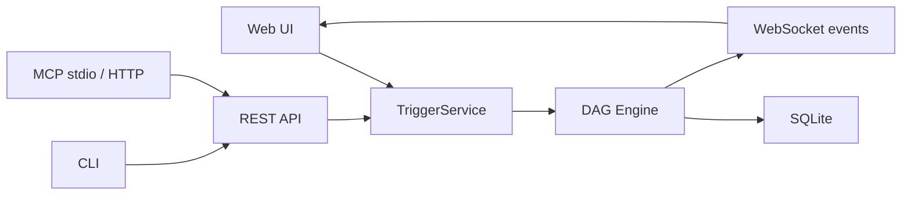

# Goflow

Local-first workflow automation in a single Go binary.

Build, run, and debug workflows through a visual editor, REST API, CLI, or MCP without Docker, Node.js, PostgreSQL, or a separate frontend server in production.

[](https://go.dev/)
[](LICENSE)
[](https://github.com/hstptcn5/Goflow/releases)
[](https://github.com/hstptcn5/Goflow/actions)

Goflow is built for developers, AI agents, homelabs, small servers, and internal automation where deployment simplicity and local ownership matter more than a large hosted integration marketplace.

```bash
goflow serve
```

Open [http://127.0.0.1:8080](http://127.0.0.1:8080), create a workflow, add a trigger, add an action, then click **Test Workflow**.

---

## Why Goflow?

- **One binary**: the Go backend and Vue visual editor are embedded into one executable.
- **Local-first**: workflows, executions, credentials, and configuration stay on your machine or server by default.
- **SQLite by default**: no PostgreSQL, Redis, or external queue is required for normal self-hosted use.
- **Shared runtime**: Web UI, REST API, CLI, MCP stdio, and MCP HTTP all call the same backend execution path.
- **Agent-friendly**: expose approved workflows to AI tools through REST, CLI, or MCP without giving the agent direct database access.
- **Simple operations**: backup the SQLite database, the credential master key, and exported workflow JSON.

Goflow typically runs with a small idle footprint. See [reproducible local benchmarks](docs/BENCHMARKS.md) for measured smoke-test results and methodology.

## Goflow vs n8n

Goflow is not trying to replace n8n for every team automation use case. It optimizes for a different shape of deployment.

| Area | Goflow | n8n |
|---|---|---|
| Best for | Local/internal automation, developer tools, agents | Broad integrations and team automation |
| Deployment | Single binary | Docker, npm, or hosted cloud |
| Storage | Embedded SQLite | External or managed persistence setup |
| Integrations | Focused built-ins and plugins | Large integration ecosystem |
| Agent access | REST, CLI, and MCP | API and ecosystem integrations |
| Operations | Local files, API key/scoped tokens | Workspace/user/admin model |

Choose n8n for its mature integration ecosystem. Choose Goflow when deployment simplicity, local ownership, and agent-friendly interfaces matter more.

## Who Goflow Is For

Goflow is designed for trusted local and small internal automation where deployment simplicity, local ownership, and controlled agent access matter more than a large connector marketplace.

See [Who Is Goflow For?](docs/WHO_IS_GOFLOW_FOR.md) for the primary scenario, capability boundary, alternatives, and non-goals.

## Quick Start

### Download a release

Download the latest build from [GitHub Releases](https://github.com/hstptcn5/Goflow/releases), unzip it, then run:

```bash
./goflow serve
```

On Windows PowerShell:

```powershell
.\goflow.exe serve
```

Open [http://127.0.0.1:8080](http://127.0.0.1:8080).

### Build from source

```bash
git clone https://github.com/hstptcn5/Goflow.git
cd Goflow
go build -o goflow main.go static_embed.go
./goflow serve
```

On Windows:

```powershell
git clone https://github.com/hstptcn5/Goflow.git
cd Goflow
go build -o goflow.exe main.go static_embed.go
.\goflow.exe serve
```

### Create your first workflow

1. Open [http://127.0.0.1:8080](http://127.0.0.1:8080).
2. Create a workflow.
3. Add **Manual Trigger** or **Webhook Trigger**.
4. Add an action such as **HTTP Request**, **JSON Transform**, **Discord Webhook**, or **Delay / Sleep**.
5. Connect the nodes.
6. Click **Save**.
7. Click **Test Workflow**.
8. Open the node inspector to review Input, Output, Logs, and execution status.

### Run with an API key

For anything beyond trusted localhost use, set an admin API key:

```bash
GOFLOW_API_KEY=change-me ./goflow serve
```

On Windows PowerShell:

```powershell
$env:GOFLOW_API_KEY="change-me"
.\goflow.exe serve
```

If you bind outside loopback, Goflow requires `GOFLOW_API_KEY`:

```bash
GOFLOW_HOST=0.0.0.0 GOFLOW_API_KEY=change-me ./goflow serve
```

API clients authenticate with:

```http
Authorization: Bearer <api-key-or-scoped-token>
```

## What You Can Build

- **Webhook alerting**: receive a webhook, validate the payload, branch on severity, and notify Slack or Discord.
- **Scheduled API jobs**: run on a cron schedule, call an API, transform the response, and store or send the result.
- **Agent-controlled workflows**: expose a small allowlisted workflow to an AI agent through MCP so the agent can run approved automation without direct system access.
- **Internal glue**: connect GitHub, email, webhooks, SSH commands, JSON transforms, and custom plugins for small operational tasks.
- **Local automation helpers**: use CLI or REST calls from scripts while keeping execution history, idempotency, cancellation, and audit records in Goflow.

Ready-to-import workflow examples live in [templates/](templates/).

## Core Capabilities

- Visual workflow editor with drag-and-drop canvas.
- Data mapping and runtime expressions such as `{{json_1.transformed.email}}`.
- Parameters, Input, Output, and Logs inspector tabs.
- Execution selector, failed-path highlighting, replay, retry, cancellation, and redacted debug bundles.
- Webhook and cron triggers.
- Encrypted credential storage using AES-256-GCM.
- REST API, CLI alpha, MCP stdio alpha, and MCP Streamable HTTP beta.
- Scoped tokens, workflow allowlists, audit events, and MCP exposure controls.
- Import/export workflow JSON.
- Built-in nodes plus process-based JSON plugins.

## Built-In Nodes

Goflow includes focused nodes for:

- Triggers: manual, webhook, cron, GitHub webhook.
- Logic: IF / ELSE, delay, JSON transform, JavaScript, sub-workflow.
- Communication: SMTP email, Telegram, Discord, Slack, Gmail.
- Data and SaaS: HTTP, Google Sheets, Google Drive, Notion.
- Databases and infrastructure: PostgreSQL, MySQL, MongoDB, Redis, SSH, Git.
- AI and extension points: OpenAI, DeepSeek, Goflow plugin.

See [NODES.md](NODES.md) for the full node reference, credentials, placeholders, examples, and troubleshooting.

## Architecture

All entry points share the same backend execution service.


```mermaid
flowchart LR
    UI["Web UI"] --> TS["TriggerService"]
    REST["REST API"] --> TS
    CLI["CLI"] --> REST
    MCP["MCP stdio / HTTP"] --> REST
    TS --> DAG["DAG Engine"]
    DAG --> SQL["SQLite"]
    DAG --> WS["WebSocket events"]
    WS --> UI
```

This keeps behavior consistent across browser runs, API calls, CLI automation, and AI-agent MCP tools. CLI and MCP do not run their own workflow engine.

## CLI And MCP

The `goflow` binary includes an early CLI:

```bash
goflow status
goflow workflow list
goflow workflow run <workflow-id-or-slug> --set source=cli --wait
goflow pack validate examples/packs/hello-webhook
goflow execution get <execution-id>
goflow execution cancel <execution-id>
goflow token create mcp-runner --scope workflow:list --scope workflow:read --scope workflow:run --scope execution:read --workflow <workflow-id>
goflow mcp stdio
```

MCP access is opt-in per workflow. A workflow must be active and have **Expose to MCP** enabled before MCP clients can see or run it. Use scoped tokens for CLI/MCP runners instead of the admin API key.

Read more:

- [CLI and MCP roadmap](CLI_MCP_ROADMAP.md)
- [MCP Streamable HTTP setup](MCP_HTTP.md)

## Documentation

| Topic | Document |
|---|---|
| Installation and configuration | [docs/INSTALLATION.md](docs/INSTALLATION.md) |
| Node reference | [NODES.md](NODES.md) |
| CLI usage | [docs/CLI.md](docs/CLI.md) |
| Pack Format | [docs/PACKS.md](docs/PACKS.md) |
| MCP stdio and HTTP | [docs/MCP.md](docs/MCP.md), [MCP_HTTP.md](MCP_HTTP.md) |
| Security model | [docs/SECURITY.md](docs/SECURITY.md) |
| Backup and restore | [BACKUP.md](BACKUP.md) |
| Plugins | [PLUGINS.md](PLUGINS.md) |
| Architecture | [docs/ARCHITECTURE.md](docs/ARCHITECTURE.md) |
| Expressions and mapping | [docs/ADR_EXPRESSION_AND_MAPPING_MODEL.md](docs/ADR_EXPRESSION_AND_MAPPING_MODEL.md) |
| Benchmarks | [docs/BENCHMARKS.md](docs/BENCHMARKS.md) |
| Development | [docs/DEVELOPMENT.md](docs/DEVELOPMENT.md) |
| Roadmap | [ROADMAP.md](ROADMAP.md), [ROADMAP_PROGRESS.md](ROADMAP_PROGRESS.md), [UX_GOAL_PROGRESS.md](UX_GOAL_PROGRESS.md) |
| Releases | [RELEASE.md](RELEASE.md), [CHANGELOG.md](CHANGELOG.md) |
| Commercial and trademark | [COMMERCIAL.md](COMMERCIAL.md), [TRADEMARK.md](TRADEMARK.md) |

## Project Status And Limitations

Current status: **secure self-hosted preview**.

Goflow is recommended for trusted single-user or small internal deployments. It is useful today for local automation, internal tools, webhook routing, scheduled jobs, and agent-controlled workflows.

Not yet available:

- Multi-user workspaces.
- Full RBAC and SSO.
- Enterprise governance features.
- Hosted managed service.
- Large third-party integration marketplace.

For public network deployments, run behind HTTPS, set `GOFLOW_API_KEY`, prefer scoped tokens for automation clients, and back up both the SQLite database and credential master key.

## License And Commercial Direction

The Community edition in this repository is licensed under the [MIT License](LICENSE). The MIT License covers the software code; it does not grant trademark rights to the Goflow name, logo, or branding.

Goflow follows an open-core direction. The self-hosted core stays useful for real local and internal automation. Future commercial work may focus on team governance, managed operations, premium integrations, support, and hosted infrastructure.

See [COMMERCIAL.md](COMMERCIAL.md) and [TRADEMARK.md](TRADEMARK.md) for details.
