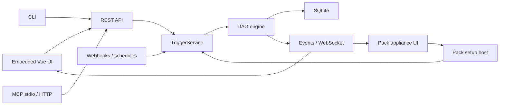

# Goflow

Local-first workflow automation and portable workflow appliances in a single Go binary.

[](https://github.com/hstptcn5/Goflow/actions/workflows/ci.yml)
[](go.mod)
[](docs/BETA_LIMITATIONS.md)
[](LICENSE)
## What Goflow Is

Goflow is a self-hosted workflow engine for trusted local and small internal automation.
Its Go backend, Vue editor, API, scheduler, credential store, CLI, MCP bridge, and Pack
appliance host share one runtime.

The normal deployment is one executable backed by SQLite. It needs no Docker, Node.js,
PostgreSQL, Redis, or separate frontend server at runtime. Node.js is needed only to
rebuild the embedded UI from source.

Goflow is for developers, operators, AI-agent tool builders, homelabs, and small internal
systems that value local ownership over a large hosted integration catalog.

## Product Status

**Current status: Productization Beta.**

The merged beta has passed repository CI, deterministic Pack build checks, tamper checks,
clean-checkout checks, native Windows appliance smoke tests, and the offline DailyOps
end-to-end suite. The repository owner also reports manual use on multiple Windows
devices. That is useful pilot evidence, not independent certification or proof of demand.

The Windows DailyOps artifact is an **unsigned pilot beta**, not a GitHub Release.
SmartScreen or organizational policy may block it. Actions artifacts are temporary
handoff outputs that must be matched to their workflow commit and verified before use.

There is currently no installer, production signing, release channel,
auto-update service, hosted control plane, marketplace, or supported commercial
vendor adapter.

## Why Goflow

- **One runtime:** UI, REST, CLI, MCP, triggers, and Packs use the same execution services.
- **Local ownership:** workflows, history, setup, and encrypted credentials stay local unless a workflow sends data elsewhere.
- **Small operational surface:** one binary and SQLite by default, with no external queue or database requirement.
- **Controlled access:** scoped tokens and workflow allowlists let clients invoke approved workflows without database access.
- **Portable use cases:** Pack Format v1 turns a reviewed workflow and setup contract into a verifiable appliance bundle.
- **Inspectability:** input, output, logs, status, cancellation, and bounded diagnostics are available in the UI and APIs.

See the [local benchmark methodology](docs/BENCHMARKS.md) for measured results;
this README does not make generalized performance claims.

## Two Ways To Use Goflow

### Workflow automation platform

Build Goflow from source, run `goflow serve`, and create workflows in the visual
editor. This path exposes the general workflow platform: triggers, built-in
nodes, credentials, execution history, REST, CLI, and MCP.

Use this path when you want to design and operate your own local workflows.

### Portable Pack appliance

Run a Pack source directory with `goflow pack run`, or use a bundle built for
the matching operating system and architecture. A Pack declares one managed
workflow, non-secret setup fields, credential requirements, bindings, assets,
and required host capabilities.

Pack Run serves a focused setup and operations UI on loopback. Runtime state is
kept outside the Pack source and extracted bundle. Packaged executable plugins
are intentionally unsupported in the current Pack appliance boundary.

Use this path when a reviewed workflow should behave like a small,
task-specific local application.

## DailyOps Beta

[DailyOps](examples/packs/dailyops-rest-telegram/) is the reference Productization
Beta appliance. It fetches one normalized JSON report over HTTP or HTTPS,
formats a daily operations summary, and sends exactly one Telegram message per
successful execution.

The source contract requires:

| Field | Type | Example |
|---|---|---|
| `report_date` | string | `2026-08-09` |
| `timezone` | string | `Asia/Bangkok` |
| `revenue` | number | `48250.75` |
| `order_count` | non-negative integer | `314` |
| `cancelled_refunded_count` | non-negative integer | `7` |
| `low_stock_summary` | string | `3 SKUs below threshold` |
| `comparison_summary` | string | `Revenue up 12.4% vs prior day` |

DailyOps supports manual execution or one local daily schedule using an IANA
timezone. Setup tests the source and Telegram access before activation. The
Telegram token is stored as an encrypted credential; it is not embedded in the
Pack, workflow, URL, or diagnostics.

Concurrent duplicate runs are rejected. Setup, credential references, managed workflow
identity, and schedule persist outside the bundle and survive restart. A migration or
relevant setup change fails closed until setup is reviewed, tested, and completed again.

DailyOps is a generic normalized-JSON-to-Telegram example. It does not claim
compatibility with any store, point-of-sale, accounting, or commerce vendor.
Use sanitized data and a dedicated non-production Telegram bot for a pilot.

Read the [source JSON contract](docs/BETA_SOURCE_JSON_CONTRACT.md),
[Telegram setup](docs/BETA_TELEGRAM_SETUP.md), and
[schedule/timezone behavior](docs/BETA_SCHEDULE_TIMEZONE.md) before operating it.

## Quick Start

### Build and run the platform from source

Requirement: Go `1.25.13`.

POSIX shell:

```bash
git clone https://github.com/hstptcn5/Goflow.git
cd Goflow
go build -o goflow main.go static_embed.go
./goflow serve
```

Windows PowerShell:

```powershell
git clone https://github.com/hstptcn5/Goflow.git
Set-Location Goflow
go build -o goflow.exe main.go static_embed.go
.\goflow.exe serve
```

Open [http://127.0.0.1:8080](http://127.0.0.1:8080), create a workflow, connect
a trigger to one or more actions, save it, and run a test execution.

### Run DailyOps from source

Windows PowerShell:

```powershell
go build -o goflow.exe main.go static_embed.go
.\goflow.exe pack validate examples/packs/dailyops-rest-telegram
.\goflow.exe pack test examples/packs/dailyops-rest-telegram --output json
.\goflow.exe pack run examples/packs/dailyops-rest-telegram
```

On POSIX systems, build `goflow` and use the same Pack subcommands with
`./goflow`.

### Use the Windows portable pilot bundle

The unsigned Windows AMD64 bundle is produced by the repository CI workflow,
not published as a Release. Obtain the exact-head artifact from the pilot
coordinator, verify its commit marker and `SHA256SUMS.txt`, extract the inner
bundle, then double-click `goflow.exe`.

Follow the complete [Windows pilot guide](docs/WINDOWS_PILOT_GUIDE.md). Do not
run an artifact whose hash or expected commit does not match the handoff.

## Pack Lifecycle

Pack Format v1 uses a closed, deterministic lifecycle:

```text
pack init -> pack validate -> pack test -> pack build -> pack verify -> pack run
```

```bash
goflow pack init ./my-pack --id example.my-pack --name "My Pack"
goflow pack validate ./my-pack
goflow pack test ./my-pack --output json
goflow pack build ./my-pack --output ./dist
goflow pack verify ./dist/example.my-pack-0.1.0-linux-amd64.zip
goflow pack run ./my-pack --data-dir ./pack-data --no-open
```

Pack Format v1 is declarative. Validation and build do not execute Pack-provided
programs or packaged plugins. Offline fixtures are bounded, non-secret author inputs and are
excluded from built bundles. Builds inventory shipped files in `PACK_INFO.json`
and are deterministic for identical source files and target runtime.

`pack verify` checks archive or extracted-bundle integrity; checksums alone do
not establish publisher identity. Optional Ed25519 signing commands exist as an
offline development foundation. Verification requires an explicitly trusted
external public key; Goflow has no production key governance or trusted
publisher service. Pack Run is loopback-only, stores state outside the Pack and
application directory, and does not support packaged plugin execution.

See [Pack Format and lifecycle](docs/PACKS.md), the
[Pack author tutorial](docs/PACK_AUTHOR_TUTORIAL.md), and
[development signing boundary](docs/PACK_SIGNING.md).

## Capabilities

- Visual graph editor with mappings, execution inspection, replay, retry, cancellation, and redacted diagnostics.
- Manual, webhook, cron, and GitHub webhook triggers.
- DAG execution with bounded node parallelism and execution concurrency.
- REST API, WebSocket updates, CLI, MCP stdio, and MCP Streamable HTTP.
- Scoped API tokens, workflow allowlists, idempotency, and audit events.
- Import and export of workflow JSON.
- AES-256-GCM credential storage with a separately required master key.
- Pack setup schemas, credential slots, closed capabilities, connection tests, deterministic builds, and tamper rejection.
- Host-managed migrations, revalidation, daily scheduling, external data, backup/restore, and local upgrade rollback.
- A normalized HTTP source adapter with bounded pagination and projection.

## Security And Data Model

Goflow is designed for a trusted local user or small internal deployment, not
for untrusted multi-tenant workflow authoring.

- The default server and every Pack appliance bind to loopback.
- A non-loopback server bind is rejected unless `GOFLOW_API_KEY` is set.
- API credentials use the `Authorization: Bearer` header; query-string API keys
  are not accepted.
- Scoped tokens can limit scopes and allowed workflow IDs.
- Saved credentials are encrypted with AES-256-GCM.
- The SQLite database and matching `goflow.master.key` must be backed up
  together; encrypted credentials cannot be recovered if the key is lost.
- Pack setup keeps secrets in credential slots rather than manifests, workflow
  parameters, URLs, fixtures, or bundle files.
- Pack path, inventory, and hash checks reject undeclared files and tampering.
- Bounded diagnostics redact configured sensitive data; review them before sharing.
- The normalized HTTP adapter strips credentials on cross-origin redirects.
- Goflow has no default remote telemetry and makes no production signing claim.
- Workflow creation is an administrator-level capability. Scoped execution does
  not sandbox an unsafe workflow.

The HTTP Request node can access private-network services, and the SSH node does
not yet verify host keys. Run Goflow with only the operating-system permissions
and network access its workflows need. Put non-local deployments behind HTTPS.

Read [Security](docs/SECURITY.md), [Pack data backup and restore](docs/DATA_BACKUP_RESTORE.md),
and [credential rotation](docs/CREDENTIAL_ROTATION.md).

## Architecture

All external entry points converge on the same backend execution path. Pack Run
adds a focused appliance UI and setup layer but reuses the host's workflow
engine and persistent stores.


```mermaid
flowchart LR
    UI["Embedded Vue UI"] --> API["REST API"]
    CLI["CLI"] --> API
    MCP["MCP stdio / HTTP"] --> API
    WEBHOOK["Webhooks / schedules"] --> TS["TriggerService"]
    API --> TS
    APPLIANCE["Pack appliance UI"] --> SETUP["Pack setup host"]
    SETUP --> TS
    TS --> DAG["DAG engine"]
    DAG --> DB["SQLite"]
    DAG --> EVENTS["Events / WebSocket"]
    EVENTS --> UI
    EVENTS --> APPLIANCE
```

For component responsibilities and execution flow, see
[Architecture](docs/ARCHITECTURE.md).

## CLI

The binary includes commands for platform status, workflows, executions,
tokens, MCP, and Packs:

```bash
goflow status --output json
goflow workflow list --active
goflow workflow describe <workflow-id-or-slug>
goflow workflow run <workflow-id-or-slug> --set source=cli --wait
goflow workflow export <workflow-id-or-slug> --output workflow.json
goflow workflow import workflow.json --activate
goflow execution watch <execution-id> --timeout 60s
goflow execution cancel <execution-id>
goflow token create mcp-runner --scope workflow:list --scope workflow:run --workflow <workflow-id>
goflow mcp stdio
```

CLI and MCP are clients of the REST execution path; they do not run separate
workflow engines. MCP workflow exposure is opt-in and requires an active,
explicitly exposed workflow plus an appropriate scoped token.

See [CLI reference](docs/CLI.md), [MCP overview](docs/MCP.md), and
[MCP HTTP setup](MCP_HTTP.md).

## Built-In Nodes And Adapters

Built-in node groups include:

- **Triggers:** manual, webhook, cron, and GitHub webhook.
- **Logic and data:** IF/ELSE, delay, JSON transform, JavaScript, and
  sub-workflow.
- **Communication:** SMTP email, Telegram, Discord, Slack, and Gmail.
- **Services:** generic HTTP, Google Sheets, Google Drive, and Notion.
- **Databases and infrastructure:** PostgreSQL, MySQL, MongoDB, Redis, SSH,
  and Git.
- **AI and extension:** OpenAI, DeepSeek, and the platform Goflow plugin node.

The normalized HTTP source adapter is a narrower Pack-oriented contract. It is
GET-only, accepts absolute HTTP(S) URLs, supports bounded projection and
pagination, limits response size and retries, and strips credentials on
cross-origin redirects.

The platform plugin node is distinct from Pack distribution: Pack appliances
currently reject packaged plugins rather than executing untrusted bundled
programs.

See the [node guide](NODES.md) and [adapter contract](docs/ADAPTERS.md).

## Goflow Vs n8n

Goflow and n8n solve overlapping workflow problems with different product and
operational tradeoffs.

| Area | Goflow Productization Beta | n8n |
|---|---|---|
| Primary fit | Trusted local/internal automation and focused appliances | Broad team automation and integration coverage |
| Deployment | One Go binary with embedded UI and SQLite by default | Self-hosted or managed cloud deployment options |
| Integration breadth | Focused built-ins, generic protocols, early Pack model | Large established connector ecosystem |
| Portable use-case UI | Pack appliance setup and operations surface | Workflow/editor-centric product surface |
| Agent entry points | REST, CLI, MCP stdio, MCP HTTP | APIs and platform integrations |
| Current maturity | Unsigned beta with explicit pilot limits | Mature production product |

Choose n8n when connector breadth, hosted service, team features, and an
established ecosystem are primary requirements. Evaluate Goflow when a compact
local runtime, controlled agent access, or a focused portable appliance is the
more important constraint.

## Documentation

| Topic | Document |
|---|---|
| Installation and configuration | [Installation](docs/INSTALLATION.md) |
| Productization Beta operations | [Beta operations index](docs/BETA_OPERATIONS.md) |
| Windows portable pilot | [Windows pilot guide](docs/WINDOWS_PILOT_GUIDE.md) |
| DailyOps source and schedule | [Source contract](docs/BETA_SOURCE_JSON_CONTRACT.md), [schedule/timezone](docs/BETA_SCHEDULE_TIMEZONE.md) |
| Pack authoring | [Pack Format](docs/PACKS.md), [author tutorial](docs/PACK_AUTHOR_TUTORIAL.md) |
| Pack integrity and signing | [Pack signing](docs/PACK_SIGNING.md) |
| Pack state and recovery | [Data backup/restore](docs/DATA_BACKUP_RESTORE.md), [credential rotation](docs/CREDENTIAL_ROTATION.md) |
| CLI | [CLI reference](docs/CLI.md) |
| MCP | [MCP overview](docs/MCP.md), [HTTP setup](MCP_HTTP.md) |
| Nodes and adapters | [Node guide](NODES.md), [adapter contract](docs/ADAPTERS.md) |
| Security | [Security model](docs/SECURITY.md) |
| Architecture | [Architecture](docs/ARCHITECTURE.md) |
| Development and tests | [Development](docs/DEVELOPMENT.md) |
| Deferred work | [Post-beta roadmap](docs/productization/POST_BETA_ROADMAP.md) |

## Current Limitations

- Productization Beta is unsigned pilot software, not a production release.
- There is no installer, trusted publisher chain, release channel, background
  update, marketplace, or automatic uninstall.
- Pack appliances are loopback-only and designed for one trusted local user.
- Multi-user workspaces, full RBAC, SSO, enterprise governance, high
  availability, and hosted management are not implemented.
- DailyOps accepts the documented normalized JSON contract only and makes no
  vendor compatibility claim.
- Packaged plugins and Pack-provided migration code are unsupported.
- Optional Pack signatures are a development mechanism, not production trust.
- Public-network operation requires operator-supplied HTTPS and careful access
  control.
- The SSH node lacks strict known-host verification.
- Pilot reports do not establish customer validation, production reliability,
  support commitments, or willingness to pay.

See [Beta limitations](docs/BETA_LIMITATIONS.md) for the maintained boundary.

## Roadmap

Post-beta work is gated by evidence and separate review, not promised on a
date-based schedule. Candidate areas include:

- one vendor-specific commercial adapter only after real customer need selects
  a vendor and authorized sandbox, API, legal, and contract evidence exists;
- production signing and releases only after key custody, revocation,
  provenance, and manual Windows acceptance are defined;
- user-approved remote updates only with authenticated artifacts,
  anti-rollback, atomic installation, health checks, and tested rollback;
- a curated registry only after publisher governance, scanning, compatibility,
  incident response, legal, payment, and support decisions;
- hosted or enterprise features only after separate product evidence and threat
  models.

The authoritative deferred-work list is the
[post-beta roadmap](docs/productization/POST_BETA_ROADMAP.md).

## License And Commercial Direction

The Community edition in this repository is licensed under the
[MIT License](LICENSE). The license permits use, copying, modification, and
distribution subject to its terms. It does not grant rights to misuse the
Goflow name, logo, or project identity; see [Trademark](TRADEMARK.md).

The repository is the usable Community edition. Future paid offerings may
include supported vendor integrations, maintained task-specific Packs,
setup/migration/support services, or optional team governance, but no such
product or availability is claimed here. See
[Commercial direction](COMMERCIAL.md) for candidate positioning.
