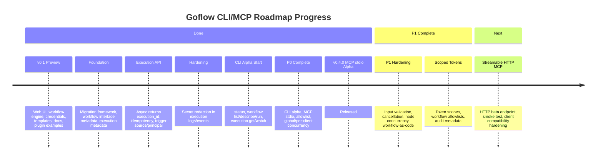
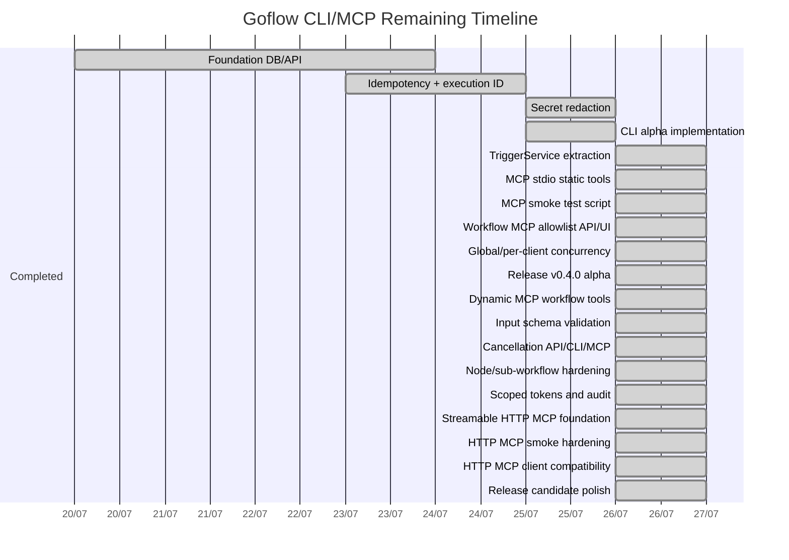

# Goflow Roadmap Progress

This document tracks the current implementation progress for the Goflow CLI and MCP roadmap.

## Timeline Overview



## Phase Status

| Phase | Goal | Status |
| :--- | :--- | :--- |
| `v0.2.0-foundation-preview` | Migration, execution metadata, async execution ID, idempotency | Mostly complete and tested manually |
| `v0.3.0-cli-alpha` | CLI status/list/describe/run/get/watch | Initial implementation complete; needs more real-workflow testing |
| `v0.4.0-mcp-stdio-alpha` | MCP stdio static tools | Released |
| `v0.5.0-mcp-dynamic-preview` | Workflow MCP exposure, dynamic tools, input schema validation | Dynamic workflow tools and input validation implemented |
| Hardening | Concurrency, cancellation, scoped token, audit | Complete for P1 |
| Streamable HTTP MCP | `/mcp` HTTP transport | P2 complete; ready for release-candidate testing |

## P0 Checklist

```text
[x] Migration framework
[x] Async execution ID
[x] Execution source/principal
[x] Idempotency
[x] Workflow input/output schema fields
[x] Secret redaction in execution logs
[x] CLI status/list/describe/run/get/watch initial implementation
[x] TriggerService service layer
[x] MCP stdio static tools
[x] MCP client smoke test script
[x] Workflow MCP allowlist UI/API
[x] Global/per-client MCP concurrency
```

## P1 Checklist

```text
[x] Dynamic MCP workflow tools
[x] Server-side input schema validation
[x] Node concurrency limit
[x] Sub-workflow nested slot fix
[x] Cancellation API
[x] CLI cancel
[x] MCP cancel
[x] CLI import/export/validate
[x] Scoped token
[x] Audit metadata
```

## P2 Checklist

```text
[x] Streamable HTTP MCP endpoint at /mcp
[x] Bearer auth through scoped tokens/API key
[x] Origin allowlist for browser/remote clients
[x] HTTP MCP smoke test script
[x] HTTP MCP workflow and dynamic tool smoke test support
[x] Production deployment notes for reverse proxies/TLS
[x] Real-client compatibility testing
[x] Release candidate checklist
[x] HTTP MCP setup/troubleshooting guide
[x] Workflow Interface MCP readiness UI
```

## Remaining Timeline



## Next Priorities

1. Package a preview release candidate.
2. Run the release checklist against the packaged archive.
3. Publish the release after smoke tests pass on a clean machine.
