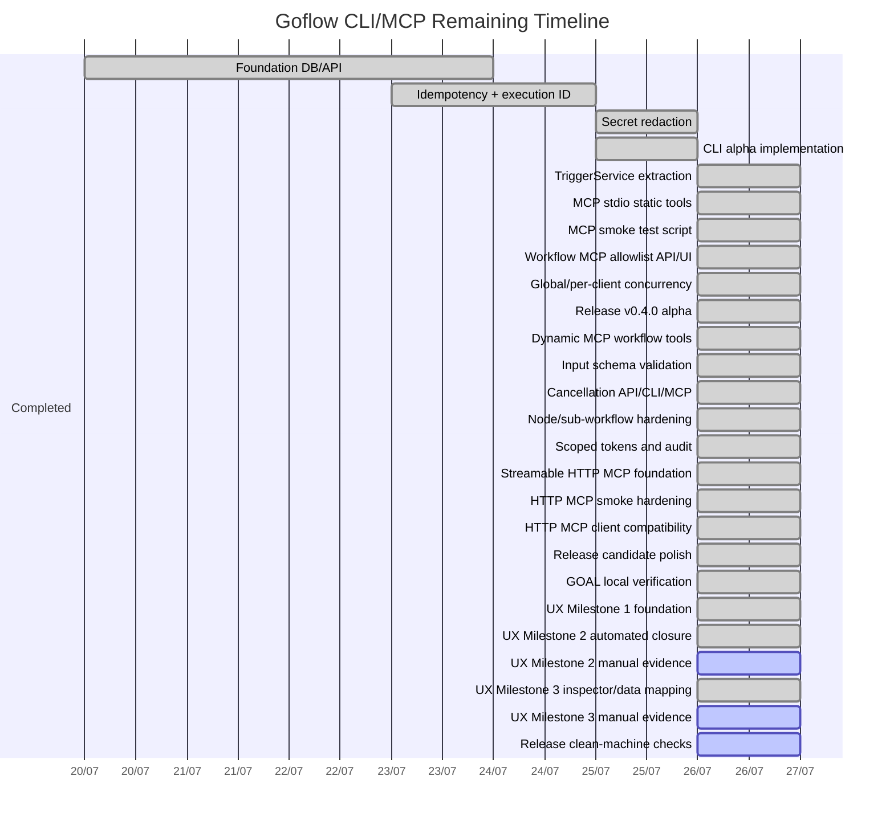

# Goflow Roadmap Progress

This document tracks the current implementation progress for the Goflow CLI and MCP roadmap.

## Timeline Overview

```mermaid
timeline
    title Goflow CLI/MCP Roadmap Progress

    section Done
      v0.1 Preview : Web UI, workflow engine, credentials, templates, docs, plugin examples
      Foundation : Migration framework, workflow interface metadata, execution metadata
      Execution API : Async returns execution_id, idempotency, trigger source/principal
      Hardening : Secret redaction in execution logs/events
      CLI Alpha Start : status, workflow list/describe/run, execution get/watch
      P0 Complete : CLI alpha, MCP stdio, allowlist, global/per-client concurrency
      v0.4.0 MCP stdio Alpha : Released

    section P1 Complete
      P1 Hardening : Input validation, cancellation, node concurrency, workflow-as-code
      Scoped Tokens : Token scopes, workflow allowlists, audit metadata

    section Done
      Streamable HTTP MCP : HTTP beta endpoint, smoke test, client compatibility hardening
      GOAL Hardening Pass : security, idempotency, limits, validator, MCP safety
      UX Milestone 1 : app shell, routed pages, save state, frontend test foundation
      UX Milestone 2 : editor usability closure, snapshots, dirty run safety
      UX Milestone 3 : inspector tabs, data mapping, expression preview
```



## Phase Status

| Phase | Goal | Status |
| :--- | :--- | :--- |
| `v0.2.0-foundation-preview` | Migration, execution metadata, async execution ID, idempotency | Mostly complete and tested manually |
| `v0.3.0-cli-alpha` | CLI status/list/describe/run/get/watch | Initial implementation complete; needs more real-workflow testing |
| `v0.4.0-mcp-stdio-alpha` | MCP stdio static tools | Released |
| `v0.5.0-mcp-dynamic-preview` | Workflow MCP exposure, dynamic tools, input schema validation | Dynamic workflow tools and input validation implemented |
| Hardening | Concurrency, cancellation, scoped token, audit | Complete for P1 |
| Streamable HTTP MCP | `/mcp` HTTP transport | P2 complete and smoke tested |
| GOAL hardening | North Star audit items for security, idempotency, source tracking, exposure, validator, MCP safety, sub-workflow safety, and smoke coverage | Local unit and Windows smoke verification pass; release still requires final full gate and clean-machine checks |
| UX Milestone 1 | UX audit, app shell, durable Workflows/Editor/Executions/Credentials pages, design tokens, save state, frontend test foundation | Implemented and covered by frontend unit tests, Playwright smoke, and embedded route fallback test |
| UX Milestone 2 | Editor usability: searchable picker, quick-add, node cards, validation, undo/redo, duplicate/copy/paste, auto-layout, shortcuts, save-before-run, draft saves, focus trap, visual baselines, and separated performance smoke | Code complete for automated scope; manual usability and cross-machine evidence remain |
| UX Milestone 3 | Inspector and data mapping: Parameters/Input/Output/Logs tabs, inline validation, credential action, JSON tree/table/raw views, transitive upstream data picker, Fixed/Expression switching, expression preview, runtime parity, server-redacted output/log rendering, and dirty save-before-activate | Automated closure complete; manual usability evidence remains |

## P0 Checklist

```text
[x] Migration framework
[x] Async execution ID
[x] Execution source/principal
[x] Idempotency
[x] Workflow input/output schema fields
[x] Secret redaction in execution logs
[x] CLI status/list/describe/run/get/watch initial implementation
[x] TriggerService service layer
[x] MCP stdio static tools
[x] MCP client smoke test script
[x] Workflow MCP allowlist UI/API
[x] Global/per-client MCP concurrency
```

## P1 Checklist

```text
[x] Dynamic MCP workflow tools
[x] Server-side input schema validation
[x] Node concurrency limit
[x] Sub-workflow nested slot fix
[x] Cancellation API
[x] CLI cancel
[x] MCP cancel
[x] CLI import/export/validate
[x] Scoped token
[x] Audit metadata
```

## P2 Checklist

```text
[x] Streamable HTTP MCP endpoint at /mcp
[x] Bearer auth through scoped tokens/API key
[x] Origin allowlist for browser/remote clients
[x] HTTP MCP smoke test script
[x] HTTP MCP workflow and dynamic tool smoke test support
[x] Production deployment notes for reverse proxies/TLS
[x] Real-client compatibility testing
[x] Release candidate checklist
[x] HTTP MCP setup/troubleshooting guide
[x] Workflow Interface MCP readiness UI
[x] GOAL smoke test script for CLI, MCP stdio, MCP HTTP, scoped token, cancellation, audit, and concurrent idempotency
[x] Server-side CLI/MCP exposure enforcement
[x] Concurrent idempotency race handling
[x] Sub-workflow cycle/depth guards
[x] Scoped workflow list summary filtering
[x] Unknown node failure does not hang execution
[x] Scoped-token dynamic MCP metadata
[x] MCP execution DTO omits raw input_json
[x] UI trigger source persistence
[x] HTTP MCP rate limit and custom-origin CORS
[x] Offline workflow validator hardening
[x] MCP dynamic tool reload/reconnect command
```

## UX Milestone 1 Checklist

```text
[x] UI audit and user journey documentation
[x] Component inventory and reuse decisions
[x] Design token foundation
[x] App shell with clear primary navigation
[x] Dedicated Workflows page
[x] Dedicated Workflow Editor route
[x] Dedicated Executions page
[x] Dedicated Credentials page
[x] Templates, Nodes, Settings, and Help route foundation
[x] Workflow saved/unsaved/saving/save-failed state
[x] Standard loading, empty, and error state component
[x] Frontend Vitest foundation
[x] Playwright E2E smoke foundation
[x] Embedded SPA route refresh fallback
```

## UX Milestone 2 Checklist

```text
[x] Searchable node picker with keyboard support
[x] Recent and favorite node lists
[x] Add step path independent of fixed palette
[x] Quick-add from node output
[x] Optional legacy node palette
[x] Node card operation summary and config state
[x] Neutral non-animated idle edges
[x] IF true/false handle labels
[x] Frontend graph validation summary and badges
[x] Dirty state coverage for editor actions
[x] Undo/redo
[x] Duplicate, copy, paste, keyboard delete
[x] Explicit auto-layout
[x] Empty canvas onboarding
[x] Keyboard shortcuts
[x] Accessibility labels and state text
[x] Dialog focus trap and focus restore
[x] Test Workflow saves dirty graph before execution
[x] Incomplete drafts can be saved while Test/Activate block invalid runnable workflows
[x] Saved/unsaved state is based on graph fingerprint after undo/redo
[x] Robust node/edge ID generation with random UUIDs and fallback
[x] Component tests
[x] E2E editor and keyboard smoke
[x] Visual regression baselines for blank canvas, node picker, empty picker, configured node, invalid IF handles, and 1366 editor
[x] Performance smoke for editor ready, picker open, picker search, and auto-layout on 10, 50, and 100-node graphs
[ ] Manual screen-reader pass
[ ] Manual timed node discovery/user testing
[ ] Low-end Windows visual/performance review
```

## UX Milestone 3 Checklist

```text
[x] Properties inspector tabs: Parameters, Input, Output, Logs
[x] Inline required, credential, JSON, number, select, URL, and expression validation
[x] Credential missing action
[x] Advanced options collapse
[x] Input JSON tree, table, raw JSON, search, copy value, copy path
[x] Data picker source selection and expression insertion
[x] Runtime-compatible Fixed/Expression mode
[x] Fixed/Expression switch-back converts safe resolved primitive preview to literal without saving UI metadata
[x] Expression preview success and error states
[x] Output JSON tree, table, raw, copy, download
[x] Logs status, duration, attempts, execution ID, and error
[x] Server-redacted execution inspector DTO and frontend redaction guard for inspector input/output/log/preview rendering
[x] Runtime expression parity for mapped node output and `$trigger`
[x] Transitive upstream picker for A -> B -> C graphs
[x] Semantic tab keyboard navigation
[x] Dirty valid Activate saves graph before activation
[x] ADR for expression and mapping data model
[x] Component tests
[x] E2E data mapping, inline validation, output/log, invalid expression, and dirty activation flows
[x] Visual regression baselines for Milestone 3 inspector states
[x] Inspector performance smoke
[ ] Manual usability timing for mapping data between nodes
[ ] Manual screen-reader pass for inspector tabs and JSON tree
```

## Remaining Timeline



## Next Priorities

1. Rebuild release artifacts from the current commit.
2. Run the release checklist against the packaged archive on a clean Windows machine.
3. Continue UX Milestone 4: execution debugger selector, failed path highlight, retry/replay, cancel/debug actions, and redacted debug bundle.
