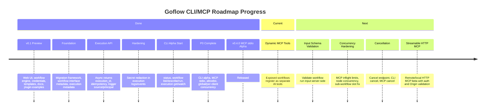
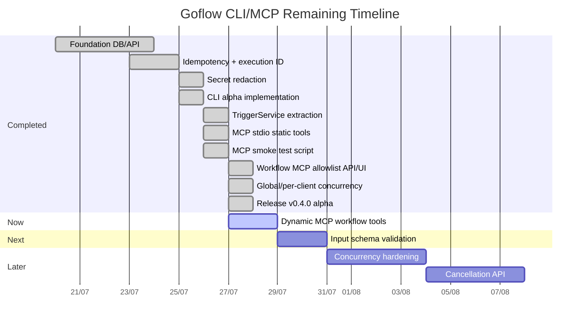

# Goflow Roadmap Progress

This document tracks the current implementation progress for the Goflow CLI and MCP roadmap.

## Timeline Overview



## Phase Status

| Phase | Goal | Status |
| :--- | :--- | :--- |
| `v0.2.0-foundation-preview` | Migration, execution metadata, async execution ID, idempotency | Mostly complete and tested manually |
| `v0.3.0-cli-alpha` | CLI status/list/describe/run/get/watch | Initial implementation complete; needs more real-workflow testing |
| `v0.4.0-mcp-stdio-alpha` | MCP stdio static tools | Released |
| `v0.5.0-mcp-dynamic-preview` | Workflow MCP exposure, dynamic tools, input schema validation | Dynamic workflow tools implemented; input validation pending |
| Hardening | Concurrency, cancellation, scoped token, audit | P0 concurrency and secret redaction complete; cancellation/scoped tokens pending |
| Streamable HTTP MCP | `/mcp` HTTP transport | Deferred |

## P0 Checklist

```text
[x] Migration framework
[x] Async execution ID
[x] Execution source/principal
[x] Idempotency
[x] Workflow input/output schema fields
[x] Secret redaction in execution logs
[x] CLI status/list/describe/run/get/watch initial implementation
[x] TriggerService service layer
[x] MCP stdio static tools
[x] MCP client smoke test script
[x] Workflow MCP allowlist UI/API
[x] Global/per-client MCP concurrency
```

## Remaining Timeline



## Next Priorities

1. Test `--expect-tool` and `--dynamic-tool` against a real exposed workflow.
2. Add server-side input schema validation for workflow runs.
3. Add node concurrency hardening.
4. Add cancellation API / CLI cancel / MCP cancel.
