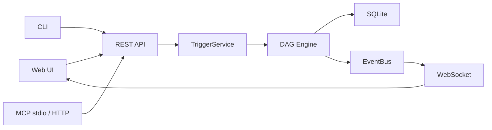

# Architecture

Goflow is a single-binary workflow automation engine with an embedded Web UI and SQLite storage.



## Runtime Contract

- The Web UI calls REST and WebSocket endpoints.
- The CLI calls REST endpoints.
- MCP stdio and MCP HTTP call REST endpoints.
- All workflow starts go through the shared `TriggerService`.
- CLI and MCP do not run a separate workflow engine.
- SQLite is the default persistence layer.

## Engine

The DAG engine executes workflow nodes according to graph dependencies. Independent nodes can run concurrently within configured limits. Conditional branches can mark non-followed paths as skipped.

The engine records execution history, node logs, status, duration, input, and redacted outputs in SQLite.

## Storage

Goflow uses SQLite in WAL mode by default. The database stores workflows, executions, credentials metadata, scoped tokens, and audit events.

Credentials are encrypted before storage. The credential master key must be backed up with the database.

## UI

The production Web UI is built from Vue and embedded into the Go binary using `static_embed.go`.

During development, the UI can be built with:

```bash
cd ui
npm ci
npm run build
```

Then rebuild the Go binary to embed the latest `ui/dist`.

